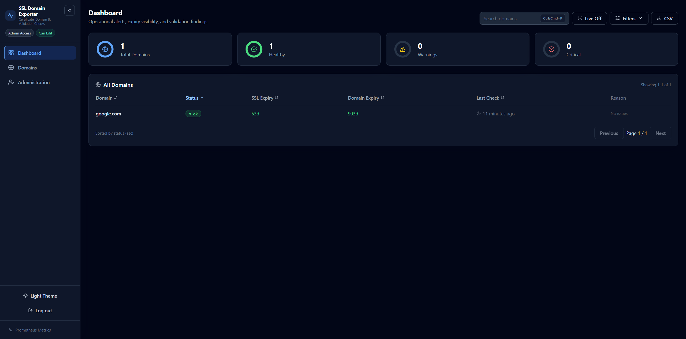
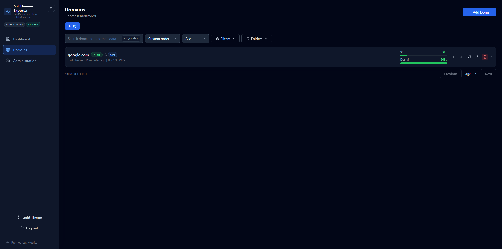
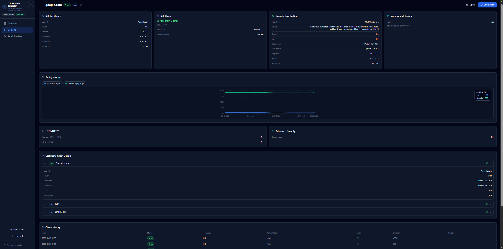
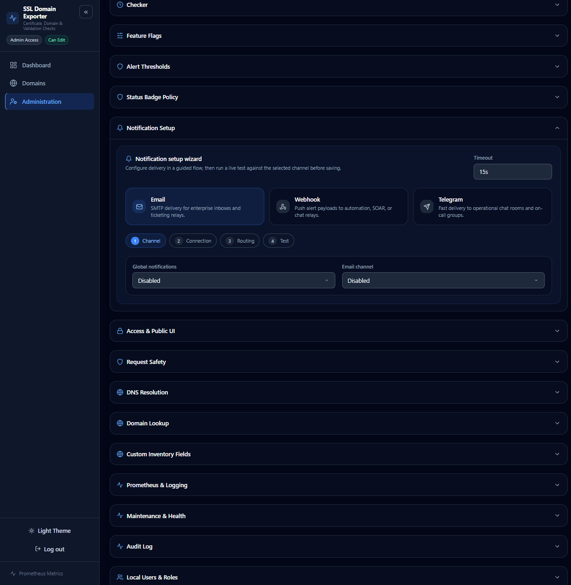

# SSL Domain Exporter

## Interface Preview

| Dashboard | Domains |
| --- | --- |
| [](docs/screenshots/main_dashboard.png) | [](docs/screenshots/main_domains.png) |
| Operational summary, filters, and watchlists. | Inventory list with folders, search, and custom ordering. |

| Domain Details | Administration |
| --- | --- |
| [](docs/screenshots/main_info.png) | [](docs/screenshots/main_settings.png) |
| Certificate chain, registration, history, and validation context. | Guided notifications, access controls, health, and maintenance. |

> Screenshot note: the exact interface can vary slightly by theme, viewport, and release build. The current UI includes responsive navigation, toast feedback, guided notification setup, and status-focused dashboard sections.

Current version: `v1.4.0`

dockerhub: https://hub.docker.com/r/beztebya666/ssl-domain-exporter

SSL Domain Exporter is a self-hosted service for monitoring SSL certificates (+chain validation), domain registration expiry dates, and DNS-related validation checks, with a web UI, REST API, SQLite storage, and Prometheus metrics. Designed for enterprise environments including air-gapped networks and internal domains.

## Features

- **SSL checks:** expiry date, issuer/subject, TLS version, certificate chain validation.
- **Domain checks:** RDAP (primary) + WHOIS (fallback), status and registration expiry.
- **Check modes:** `full` (SSL + domain registration) or `ssl_only` (skip RDAP/WHOIS). Per-domain or global default.
- **Custom DNS resolution:** per-domain and global DNS servers with tiered fallback. No silent fallback to public resolvers.
- **Multi-tag support:** each domain can have multiple tags with dedicated UI editing and API support.
- **Structured metadata:** store owner, zone, requester, change ID, environment, or other inventory attributes as key/value metadata.
- **Enterprise import:** line import and JSON batch import with `create_only`, `upsert`, `dry_run`, and optional immediate checks.
- **Optional checks:** HTTP/HTTPS, cipher grade, OCSP, CRL, CAA.
- **Per-item settings:** HTTPS port, check interval, tags, metadata, folders, custom root CA (PEM), check mode, DNS servers, and infrastructure source references for Kubernetes/F5-backed certificate inventory.
- **UI:** responsive dashboard, domain list, domain details with history, Settings, Timeline (feature flag), mobile sidebar navigation, server-side sorting/filtering, pagination, large-list virtualization, and toast-based feedback.
- **CSV export** (feature flag).
- **Notifications:** Webhook, Telegram, and Email on status change to `warning` or `critical`, plus ad-hoc notifications per domain.
- **Notification setup wizard:** guided SMTP / webhook / Telegram setup with live channel tests and delivery status.
- **Access model:** public read-only UI, local session-based users with `viewer` / `editor` / `admin` roles, plus legacy Basic/Auth API key compatibility.
- **Status clarity:** each check stores an explainable primary reason plus detailed findings, and admins can decide which findings elevate the main list/dashboard badge versus remaining advisory-only.
- **Dashboard signal separation:** operational alerts, expiry watchlist, and validation findings are shown as separate information groups.
- **Theme-aware UX:** dark/light themes, custom status styling, responsive navigation, and reduced-motion friendly transitions.
- **Prometheus endpoint** with registration-aware metrics and ready-to-use Grafana/Alertmanager files.
- **Native TLS:** serve HTTPS directly without a reverse proxy via `server.tls` config.
- **Syslog forwarding:** forward logs to a remote syslog server (RFC 3164) over TCP or UDP with auto-reconnect.
- **Kubernetes scanning:** scan TLS secrets from Kubernetes clusters to monitor certificates managed by cert-manager or other controllers.
- **F5 BIG-IP scanning:** monitor SSL certificates on F5 devices via the iControl REST API.
- **Source-backed inventory:** create monitored items from manual endpoints, Kubernetes TLS secrets, or F5 BIG-IP certificates, either manually or directly from scan results in the UI.
- **Cross-platform:** Linux, macOS, and Windows DNS discovery support.

## Check Modes

Each domain has a `check_mode`:

| Mode | SSL | RDAP/WHOIS | HTTP | Cipher | OCSP/CRL | CAA |
|------|-----|------------|------|--------|----------|-----|
| `full` | Yes | Yes | Yes* | Yes* | Yes* | Yes* |
| `ssl_only` | Yes | **Skipped** | Yes* | Yes* | Yes* | Yes* |

\* Optional, controlled by feature flags.

Use `ssl_only` for internal domains (e.g., `.local`, `.internal`) that lack public WHOIS/RDAP records.

When registration check is skipped:
- `domain_expiry_days` metric is removed (not set to 0 or fake value)
- `domain_check_success{type="domain"}` metric is removed (not falsely set to 1)
- `registration_check_skipped` and `registration_skip_reason` are stored in check history for audit
- Notifications exclude domain registration info

## Inventory Sources

`v1.4.0` supports three inventory source types:

- `manual`: classic hostname / HTTPS endpoint monitoring
- `kubernetes_secret`: monitor a certificate directly from a Kubernetes TLS secret
- `f5_certificate`: monitor a certificate directly from an F5 BIG-IP device

How it behaves:

- Manual items use the existing endpoint workflow: DNS resolution, TLS handshake, optional HTTP checks, and optional RDAP/WHOIS.
- Kubernetes/F5 items are source-backed inventory records: the checker reads certificate metadata directly from the configured source reference on each run.
- Source-backed items intentionally skip HTTP probing and domain registration lookup, because they are not tied to a public hostname by definition.
- Check interval, tags, metadata, folders, enable/disable, notifications, history, dashboard status, and CSV export still work for all source types.

UI flows:

- **Add Domain** now lets you choose `Manual endpoint`, `Kubernetes TLS secret`, or `F5 BIG-IP certificate`.
- **Settings -> Kubernetes TLS Secret Scanning** and **Settings -> F5 BIG-IP Certificate Scanning** now include a `Track` action that opens the add flow with the discovered source reference pre-filled.
- **Domain Details** lets you edit the source type and source reference later without deleting the inventory item.

Operational note:

- Source-backed monitoring still requires the exporter host to reach the Kubernetes API or F5 API at runtime.
- If the exporter cannot reach that source, the inventory item can still exist, but checks will return an error until connectivity/configuration is fixed.

API examples:

```json
{
  "source_type": "kubernetes_secret",
  "source_ref": {
    "namespace": "platform",
    "secret_name": "ingress-tls",
    "certificate_serial": "ABC123"
  }
}
```

```json
{
  "source_type": "f5_certificate",
  "source_ref": {
    "partition": "Common",
    "certificate_name": "wildcard-example-com",
    "serial": "5F01AA"
  }
}
```

## Custom Root CA

Per-domain custom trust roots are still supported through `custom_ca_pem`.

What it does:

- Stores a PEM certificate on the domain record.
- Extends the system trust store for that domain instead of replacing it.
- Is used by both SSL certificate validation and HTTPS checks.
- Lets you monitor internal services signed by a private CA without disabling chain validation.

Where it is available:

- Add domain modal: upload or paste a `.crt` / `.pem` certificate.
- Domain details edit form: update or remove the PEM later.
- REST API: `custom_ca_pem` field on create/update requests.

Behavior notes:

- Empty `custom_ca_pem` means "use default system trust store only".
- Invalid PEM is rejected during checks with `invalid custom_ca_pem certificate`.
- The PEM is treated as an additional root CA, not as a client certificate/key pair.

## Tags and Metadata

Domains now support two separate inventory layers:

- `tags`: multi-value labels such as `prod`, `api`, `customer-facing`
- `metadata`: structured key/value attributes such as `owner=platform-team`, `zone=corp`, `change_id=CHG-001`

Behavior:

- Tags are edited individually in the UI and stored as a normalized array.
- The API accepts legacy tag strings and modern tag arrays.
- Metadata keys are normalized to lowercase and may use letters, numbers, dot, dash, and underscore.
- Empty tag or metadata values are ignored.
- Metadata remains backwards-compatible even when you later introduce custom inventory field schemas.

Recommended usage:

- Use tags for low-cardinality grouping and filtering.
- Use metadata for richer inventory context. Metadata is also exported to Prometheus through a dedicated info metric instead of being copied onto every operational gauge.

Examples:

- Tags: `["prod", "api", "internal"]`
- Metadata: `{"owner":"platform-team","zone":"corp","change_id":"CHG-042"}`

## Custom Inventory Fields

Enterprise environments often need optional but standardized inventory fields such as `owner_email`, `zone`, `service_tier`, or `change_id`.

This release adds a schema-driven custom field layer on top of `metadata`:

- Configure fields in **Settings -> Custom Inventory Fields**
- Supported types: `text`, `textarea`, `email`, `url`, `date`, `select`, `number`, `ip_address`
- Per-field controls:
  - required / optional
  - enabled / disabled
  - visible in table
  - visible in details
  - visible in export
  - filterable
- Dynamic forms automatically render these fields in add/edit screens
- Filterable fields appear as first-class filters on Dashboard and Domains
- Exportable fields become dedicated CSV columns

Design notes:

- Field values are still stored in the existing `metadata` JSON, so upgrades stay backwards-compatible.
- Unknown metadata keys are still allowed and remain available as extra metadata.
- Field keys are intentionally immutable after creation to avoid silently orphaning existing inventory values.

## Import and IaC

For large environments, use batch import instead of creating domains one by one.

Supported import features:

- `create_only` mode for strict create semantics
- `upsert` mode for idempotent automation / IaC workflows
- `dry_run` for validation without DB writes
- `trigger_checks` to queue immediate checks after import
- `defaults` block for shared settings across all imported domains
- Unknown top-level fields in import items are automatically stored in `metadata`
- Import items can also carry `source_type` and `source_ref` so IaC workflows can manage Kubernetes/F5-backed inventory declaratively

The web UI supports:

- line import (`one domain per line`)
- JSON import
- shared defaults for tags, metadata, check mode, DNS, interval, folder, custom CA, and enabled state
- server-side filtering, sorting, and pagination
- `SSL <= X days` and `Domain <= X days` inventory filters
- CSV export that respects current filters
- virtualized rendering for large domain lists

Example JSON import with mixed inventory sources:

```json
{
  "mode": "upsert",
  "domains": [
    {
      "name": "example.com"
    },
    {
      "source_type": "kubernetes_secret",
      "source_ref": {
        "namespace": "platform",
        "secret_name": "ingress-tls"
      },
      "tags": ["k8s", "prod"]
    },
    {
      "source_type": "f5_certificate",
      "source_ref": {
        "partition": "Common",
        "certificate_name": "wildcard-example-com"
      },
      "metadata": {
        "owner": "network-team"
      }
    }
  ]
}
```

## DNS Resolution

DNS resolution follows a strict priority chain with no silent public fallback:

1. **Per-domain** DNS servers (`dns_servers` field on domain)
2. **Global** DNS servers (`dns.servers` in config)
3. **System** DNS (OS resolvers, only if `dns.use_system_dns: true`)

If a higher-priority tier fails, the resolver falls back to the next tier.

For TLS/HTTP/cipher/revocation hostname resolution, Go's built-in OS resolver is the final fallback when `use_system_dns` is enabled.

For CAA, Go's stdlib has no native CAA lookup API, so the checker falls back to discovered system DNS servers and common local DNS stubs instead of silently treating CAA as absent.

Custom DNS affects certificate- and HTTP-related hostname resolution plus CAA lookups. It does not currently change RDAP/WHOIS network resolution: those external registration lookups still use the default outbound network stack. For air-gapped or internal-only environments, use `ssl_only`.

On Windows, system DNS servers are discovered via `netsh interface ip show dns`.
On Linux/macOS, they are read from `/etc/resolv.conf`.

The effective DNS server used is recorded in each check as `dns_server_used` for audit trail.

## Check Statuses

- `ok`: no errors, thresholds are not exceeded.
- `warning`: upcoming expiry, invalid chain, HTTP 4xx, `cipher grade=C`, OCSP/CRL unknown, etc.
- `critical`: critical expiry, HTTP 5xx, `cipher grade=F`, revoked in OCSP/CRL.
- `error`: both SSL and domain checks failed at the same time.

Every stored check also includes:

- `primary_reason_code`
- `primary_reason_text`
- `status_reasons[]`

By default, findings such as invalid chain, missing CAA, or OCSP unknown can elevate the main badge. In enterprise environments you can tune `status_policy` so some findings stay visible in the domain details/history as `advisory` notes without turning the main dashboard/list badge yellow or red.

Recommended mental model:

- `Operational Alerts`: findings that should affect the main badge and alerting behavior
- `Expiry Watchlist`: SSL/domain expirations inside the configured thresholds
- `Validation Findings`: advisory-only technical findings that remain visible for follow-up

## Tech Stack

- Backend: Go 1.21, Gin, SQLite (`modernc.org/sqlite`), Prometheus client.
- Frontend: React + Vite + TypeScript + Tailwind.
- DB: local SQLite file (default: `./data/checker.db`).

## Requirements

- Go `1.21+`
- Node.js `20.17+` and npm
- Network access (RDAP/WHOIS/DNS/OCSP/CRL requests)

## Quick Start (Local)

### 1) Backend

```bash
go mod tidy
go run ./cmd/server
```

By default, the backend starts on `http://localhost:8080`.

### 2) Frontend (dev)

```bash
cd frontend
npm install
npm run dev
```

Frontend dev server: `http://localhost:5174` (proxies `/api` and `/metrics` to backend).

## Run Backend + Embedded UI on One Port

The backend serves `frontend/dist` as static assets. Build the UI first:

```bash
cd frontend
npm install
npm run build
cd ..
go mod tidy
go run ./cmd/server
```

After that, the UI is available at `http://localhost:8080`.

### Native TLS (HTTPS)

Starting with `v1.4.0`, the server can terminate TLS natively without a reverse proxy:

```yaml
server:
  tls:
    enabled: true
    cert_file: "/path/to/cert.pem"
    key_file: "/path/to/key.pem"
```

Environment variables: `SERVER_TLS_ENABLED`, `SERVER_TLS_CERT_FILE`, `SERVER_TLS_KEY_FILE`.

When TLS is enabled the server listens on HTTPS directly. You can still use a reverse proxy (Nginx, Caddy, Traefik, Kubernetes ingress) if you prefer external TLS termination — just leave `tls.enabled: false`.

## Docker

Build image:

```bash
docker build -t ssl-domain-exporter .
```

Run:

```bash
docker run --name ssl-domain-exporter \
  -p 8080:8080 \
  -v ./data:/app/data \
  ssl-domain-exporter
```

Container defaults:

- The image sets `CONFIG_DIR=/app/data`
- Runtime config is stored at `/app/data/config.yaml`
- SQLite data is stored at `/app/data/checker.db`
- Backup files default to `/app/data/backups`
- The container runs as an unprivileged user (`uid=10001`), so the mounted data directory must be writable by that user
- Starting with `v1.4.0`, the container can serve HTTPS natively via `server.tls` config. Alternatively, terminate TLS in a reverse proxy/load balancer in front of it.

To pre-seed configuration, place your file at `./data/config.yaml` before first start:

```bash
docker run --name ssl-domain-exporter \
  -p 8080:8080 \
  -v ./data:/app/data \
  -v ./config.yaml:/app/data/config.yaml \
  ssl-domain-exporter
```

If you prefer to keep the config outside `/app/data`, mount it separately and set `CONFIG_PATH` explicitly:

```bash
docker run --name ssl-domain-exporter \
  -p 8080:8080 \
  -v ./data:/app/data \
  -v ./config.yaml:/app/config.yaml \
  -e CONFIG_PATH=/app/config.yaml \
  ssl-domain-exporter
```

Health check:

```bash
curl http://localhost:8080/health
curl http://localhost:8080/ready
```

## Configuration

Main file: `config.yaml`.

Defaults:

- If `config.yaml` is missing, the app creates it with default values.
- Default DB path: `./data/checker.db`.
- In the container image, default runtime paths come from `CONFIG_DIR=/app/data`, so both config and DB live under `/app/data`.

Ways to set config path:

- Flag `-config <path>`
- ENV `CONFIG_PATH`
- Flag `-config-dir <dir>` or ENV `CONFIG_DIR` (config path becomes `<dir>/config.yaml`)

SQLite operational helpers:

- `go run ./cmd/server -backup ./data/backups/manual-backup.db`
- `go run ./cmd/server -restore ./data/backups/manual-backup.db`

Production secret strategy:

- Plain config values still work for simple/local deployments.
- For containers and production, prefer mounted secret files via `*_FILE` env overrides instead of storing credentials directly in `config.yaml`.
- Supported file-backed secret envs:
  - `AUTH_PASSWORD_FILE`
  - `AUTH_API_KEY_FILE`
  - `WEBHOOK_URL_FILE`
  - `TELEGRAM_BOT_TOKEN_FILE`
  - `EMAIL_PASSWORD_FILE`
  - `K8S_TOKEN_FILE`
  - `F5_PASSWORD_FILE`

Safe-start example:

```yaml
server:
  host: "0.0.0.0"
  port: "8080"
  allowed_origins: []      # optional CORS allowlist for split UI/API deployments
  tls:
    enabled: false
    cert_file: ""
    key_file: ""

database:
  path: "./data/checker.db"

dns:
  servers: []              # Global DNS servers, e.g. ["10.0.0.1:53", "10.0.0.2:53"]
  use_system_dns: true     # Fall back to OS-configured resolvers
  timeout: "5s"

domains:
  subdomain_fallback: true
  fallback_depth: 3
  default_check_mode: "full"   # "full" or "ssl_only"

auth:
  enabled: true
  mode: "basic"
  username: "admin"
  password: "change-me"
  protect_api: true
  protect_metrics: true
  protect_ui: false
  session_ttl: "24h"
  cookie_name: "ssl_domain_exporter_session"
  cookie_secure: false

security:
  csrf_enabled: true
  rate_limit_enabled: true
  login_requests: 10
  login_window: "5m"
  admin_write_requests: 300
  admin_window: "1m"

maintenance:
  backups_dir: "./data/backups"
  check_retention_days: 0          # 0 = keep history forever
  audit_retention_days: 0          # 0 = keep audit log forever
  retention_sweep_interval: "24h"

status_policy:
  badge_on_invalid_chain: true
  badge_on_self_signed: true
  badge_on_http_probe_error: true
  badge_on_http_client_error: true
  badge_on_cipher_warning: true
  badge_on_ocsp_unknown: true
  badge_on_crl_unknown: true
  badge_on_caa_missing: true
  badge_on_domain_lookup_error: true

notifications:
  timeout: "15s"
  email:
    enabled: false
    host: "smtp.example.local"
    port: 587
    mode: "starttls"
    username: "alerts@example.local"
    password: "change-me"
    from: "alerts@example.local"
    to: ["ops@example.local", "noc@example.local"]
    on_critical: true
    on_warning: true
    subject_prefix: "[SSL Domain Exporter]"

logging:
  json: false
  syslog:
    enabled: false
    network: "udp"
    address: ""
    tag: "ssl-domain-exporter"
    facility: "local0"

prometheus:
  enabled: true
  path: "/metrics"
  labels:
    export_tags: true
    export_metadata: true
    metadata_keys: []              # empty = export all metadata keys

kubernetes:
  enabled: false
  api_server: ""
  token: ""
  token_file: ""
  namespace: ""
  label_selector: ""
  insecure_skip_verify: false
  ca_cert_file: ""

f5:
  enabled: false
  host: ""
  username: ""
  password: ""
  insecure_skip_verify: false
  partition: ""
```

`status_policy` can also be tuned quickly from the UI with presets:

- `Strict`
- `Balanced`
- `Expiry-focused`

## Authentication

Supported modes:

- `basic`
- `api_key`
- `both`

Behavior is controlled by:

- `auth.protect_api`
- `auth.protect_metrics`
- `auth.protect_ui`

Authentication options:

- Anonymous read-only UI/API access when `auth.protect_ui: false`
- Local session-based browser login with cookie sessions
- Local users with `viewer`, `editor`, and `admin` roles
- Legacy admin credentials from `config.yaml`
- API key access for automation/integrations

Ways to provide API key:

- Header `X-API-Key: <key>`
- Header `Authorization: Bearer <key>`

Cross-origin browser access:

- Built-in UI and same-origin browser requests work without extra CORS config
- For split UI/API deployments, set `server.allowed_origins` to an explicit list of UI origins (for example `https://ui.example.com`)
- Credentialed cross-origin requests are rejected unless the origin is on that allowlist

UI behavior:

- `viewer`: can browse dashboard, lists, details, timeline, CSV export
- `editor`: can add/edit/delete/reorder domains and folders, and trigger checks
- `admin`: can also manage settings and local users

Important: browser login uses local sessions and accepts either a local UI user or the legacy admin username/password from `config.yaml`. API key mode is still available for automation and can be combined with browser login by using `mode: both`.

Session-authenticated browser writes now include:

- CSRF protection for `POST` / `PUT` / `DELETE`
- soft rate limiting for login and admin write endpoints
- request IDs in the `X-Request-ID` response header
- audit log entries for config, user, domain, folder, custom-field, backup, prune, and session actions

Secret editing in the UI:

- Saved secrets are masked in Settings and are not returned in plaintext by `/api/config`
- Leaving a masked secret field untouched keeps the current value
- Typing a new value replaces it
- Clicking `Clear` removes the saved value

## REST API (Main Endpoints)

### Service

- `GET /health`
- `GET /ready`
- `GET /metrics` (if enabled)

### Access / UI Bootstrap

- `GET /api/bootstrap`
- `GET /api/me`
- `POST /api/session/login`
- `POST /api/session/logout`

If you use cookie-based browser sessions outside the built-in UI, send `X-CSRF-Token` with the value from the `*_csrf` cookie on mutating requests.

### Config

- `GET /api/config`
- `PUT /api/config`
- `GET /api/notifications/status`
- `POST /api/notifications/test` - tests the selected channel; the Settings UI sends the current unsaved notification form values
- `POST /api/syslog/test` - test syslog connectivity (accepts optional config override in body)
- `GET /api/audit-logs`
- `GET /api/maintenance/backups`
- `POST /api/maintenance/backup`
- `POST /api/maintenance/prune`
- `GET /api/settings` (compat)
- `PUT /api/settings` (compat)
- `GET /api/users`
- `POST /api/users`
- `PUT /api/users/:id`
- `DELETE /api/users/:id`

### Domains

- `GET /api/domains`
- `GET /api/domains/search` - server-side inventory query with `search`, `status`, `tag`, `folder_id`, `metadata_filters`, `ssl_expiry_lte`, `domain_expiry_lte`, `sort_by`, `sort_dir`, `page`, `page_size`
- `POST /api/domains` - accepts `tags` (string or array), `metadata`, `custom_ca_pem`, `check_mode`, `dns_servers`, `enabled`
- `GET /api/domains/:id`
- `PUT /api/domains/:id` - accepts `name` (optional), `tags` (string or array), `metadata`, `custom_ca_pem`, `check_mode`, `dns_servers`, `enabled`; omitted fields keep current values; triggers re-check on significant changes
- `POST /api/domains/import` - batch import API for line/JSON/IaC workflows
- `DELETE /api/domains/:id`
- `POST /api/domains/:id/check`
- `POST /api/domains/:id/notify` - send ad-hoc notification for a domain (editor+)
- `GET /api/domains/:id/history?limit=50`
- `POST /api/domains/reorder`
- `GET /api/domains/export.csv` (only when `features.csv_export=true`)

Create / update payloads support:

- `source_type`: `manual`, `kubernetes_secret`, `f5_certificate`
- `source_ref`: source-specific object:
  - Kubernetes: `namespace`, `secret_name`, optional `certificate_serial`
  - F5: `partition`, `certificate_name`, optional `serial`
- For source-backed items, `name` becomes optional and is auto-generated as `k8s:<namespace>/<secret>` or `f5:<partition>/<certificate>`

### Folders

- `GET /api/folders`
- `POST /api/folders`
- `PUT /api/folders/:id`
- `DELETE /api/folders/:id`

### Custom Inventory Fields

- `GET /api/custom-fields`
- `POST /api/custom-fields`
- `PUT /api/custom-fields/:id`
- `DELETE /api/custom-fields/:id`

### Tags

- `GET /api/tags`

### Infrastructure Scanning

- `GET /api/k8s/certificates` - scan Kubernetes TLS secrets (admin)
- `GET /api/f5/certificates` - scan F5 BIG-IP SSL certificates (admin)

### Summary

- `GET /api/summary`

## API Request Examples

Create domain with ssl_only mode and custom DNS:

```bash
curl -X POST -u admin:<your-password> \
  -H "Content-Type: application/json" \
  -d '{"name":"internal.local","check_mode":"ssl_only","dns_servers":"10.0.0.1:53"}' \
  http://localhost:8080/api/domains
```

Create domain with a custom root CA:

```bash
curl -X POST -u admin:<your-password> \
  -H "Content-Type: application/json" \
  -d @- http://localhost:8080/api/domains <<'JSON'
{
  "name": "vcenter.internal",
  "custom_ca_pem": "-----BEGIN CERTIFICATE-----\n...\n-----END CERTIFICATE-----"
}
JSON
```

Create domain with multiple tags and metadata:

```bash
curl -X POST -u admin:<your-password> \
  -H "Content-Type: application/json" \
  -d @- http://localhost:8080/api/domains <<'JSON'
{
  "name": "api.internal",
  "tags": ["prod", "api", "internal"],
  "metadata": {
    "owner": "platform-team",
    "zone": "corp"
  },
  "check_mode": "ssl_only"
}
JSON
```

Batch import with upsert and metadata:

```bash
curl -X POST -u admin:<your-password> \
  -H "Content-Type: application/json" \
  -d @- http://localhost:8080/api/domains/import <<'JSON'
{
  "mode": "upsert",
  "dry_run": false,
  "trigger_checks": true,
  "defaults": {
    "tags": ["enterprise"],
    "metadata": {
      "zone": "corp"
    },
    "check_mode": "ssl_only"
  },
  "domains": [
    {
      "domain": "vcenter.local",
      "owner": "virtualization-team",
      "change_id": "CHG-001"
    },
    {
      "domain": "api.example.com",
      "tags": ["prod", "api"],
      "metadata": {
        "owner": "web-team"
      },
      "check_mode": "full"
    }
  ]
}
JSON
```

Run domain check:

```bash
curl -X POST -u admin:<your-password> http://localhost:8080/api/domains/1/check
```

## Feature Flags

Flags in `config.yaml -> features`:

- `http_check`
- `cipher_check`
- `ocsp_check`
- `crl_check`
- `caa_check`
- `notifications`
- `csv_export`
- `timeline_view`
- `dashboard_tag_filter`
- `structured_logs`

## Syslog Forwarding

Logs can be forwarded to a remote syslog server (RFC 3164) in addition to stdout:

```yaml
logging:
  syslog:
    enabled: true
    network: "udp"        # "tcp" or "udp"
    address: "syslog.example.com:514"
    tag: "ssl-domain-exporter"
    facility: "local0"    # kern, user, daemon, local0–local7
```

Environment variables: `SYSLOG_ENABLED`, `SYSLOG_NETWORK`, `SYSLOG_ADDRESS`, `SYSLOG_TAG`, `SYSLOG_FACILITY`.

The writer auto-reconnects on connection failures. You can test connectivity via the API:

```bash
curl -X POST -u admin:<password> http://localhost:8080/api/syslog/test
```

## Kubernetes TLS Secret Scanning

Scan Kubernetes TLS secrets to monitor certificates managed by cert-manager or other controllers:

```yaml
kubernetes:
  enabled: true
  api_server: "https://kubernetes.default.svc"
  token_file: "/var/run/secrets/kubernetes.io/serviceaccount/token"
  namespace: ""                  # empty = all namespaces
  label_selector: ""             # optional, e.g. "app=my-app"
  insecure_skip_verify: false
  ca_cert_file: "/var/run/secrets/kubernetes.io/serviceaccount/ca.crt"
```

Environment variables: `K8S_ENABLED`, `K8S_API_SERVER`, `K8S_TOKEN`, `K8S_TOKEN_FILE`, `K8S_NAMESPACE`, `K8S_LABEL_SELECTOR`, `K8S_CA_CERT_FILE`, `K8S_INSECURE_SKIP_VERIFY`.

Scan on demand:

```bash
curl -u admin:<password> http://localhost:8080/api/k8s/certificates
```

Returns parsed certificate details (subject, issuer, expiry, serial) for every `kubernetes.io/tls` secret matched by the configured namespace and label selector. The UI can also convert a discovered certificate into a tracked inventory item with one click.

## F5 BIG-IP Certificate Scanning

Monitor SSL certificates on F5 BIG-IP devices via the iControl REST API:

```yaml
f5:
  enabled: true
  host: "https://f5.example.com"
  username: "admin"
  password: "change-me"
  insecure_skip_verify: false
  partition: ""                  # empty = all partitions
```

Environment variables: `F5_ENABLED`, `F5_HOST`, `F5_USERNAME`, `F5_PASSWORD`, `F5_PASSWORD_FILE`, `F5_INSECURE_SKIP_VERIFY`, `F5_PARTITION`.

Scan on demand:

```bash
curl -u admin:<password> http://localhost:8080/api/f5/certificates
```

Returns certificate inventory (name, partition, subject, issuer, expiry, serial, key type) from the F5 device. The UI can also convert a discovered certificate into a tracked inventory item with one click.

## Ad-hoc Notifications

Send a one-off notification for any monitored domain, useful for manual escalation or sharing status with colleagues:

```bash
curl -X POST -u admin:<password> \
  -H "Content-Type: application/json" \
  -d '{"channels":["telegram"],"message":"Certificate renewing tomorrow"}' \
  http://localhost:8080/api/domains/1/notify
```

Supported options in the request body:
- `channels`: array of `"webhook"`, `"telegram"`, `"email"` (default: all enabled channels)
- `message`: custom message text (default: auto-generated from latest check)
- `subject`: custom email subject (email channel only)
- `webhook_url`, `telegram_bot_token`, `telegram_chat_id`: override per-request delivery targets
- `email_to`: override email recipients for this request (string or array)
- `recipients`: legacy alias for `email_to`

## Prometheus and Monitoring

Metrics are exposed at `prometheus.path` (default: `/metrics`).

### Gauge metrics (per domain)

| Metric | Description |
|--------|-------------|
| `domain_ssl_expiry_days` | Days until SSL certificate expires |
| `domain_expiry_days` | Days until domain registration expires (only for `full` mode) |
| `domain_overall_status` | 0=ok, 1=warning, 2=critical, 3=error, 4=unknown |
| `domain_ssl_chain_valid` | 1=valid, 0=invalid |
| `domain_check_success{type="ssl\|domain"}` | 1=success, 0=failure |
| `domain_check_duration_ms` | Check duration in milliseconds |
| `domain_last_check_timestamp` | Unix timestamp of last check |
| `domain_registration_check_enabled` | 1=full mode, 0=ssl_only |
| `domain_http_status_code` | Last HTTP status code |
| `domain_http_response_time_ms` | HTTP response time |
| `domain_http_redirects_https` | 1=yes, 0=no for HTTP to HTTPS redirect behavior |
| `domain_http_hsts_enabled` | 1=yes, 0=no for HSTS header presence |
| `domain_cipher_grade` | A=4, B=3, C=2, F=1 |
| `domain_ocsp_status` | good=1, unknown=0, revoked=-1 |
| `domain_crl_status` | good=1, unknown=0, revoked=-1 |
| `domain_caa_present` | 1=yes, 0=no |
| `domain_tag_info{domain,tag}` | Static tag info metric with value `1` for each domain/tag pair |
| `domain_metadata_info{domain,key,value}` | Static metadata info metric with value `1` for each domain metadata key/value pair |

### Counter metrics

| Metric | Description |
|--------|-------------|
| `domain_checks_total{domain,status}` | Total checks performed |
| `domain_registration_check_skipped_total{domain}` | Checks where RDAP/WHOIS was skipped |

### Important behaviors

- When a domain switches to `ssl_only`, `domain_expiry_days` and `domain_check_success{type="domain"}` are **deleted** (not zeroed)
- When a domain is deleted, all its metric series are cleaned up
- `domain_monitor_total_domains` tracks the total count
- `domain_tag_info` is the recommended metric for Grafana filtering or Prometheus joins by tag
- `domain_metadata_info` exposes structured metadata for Prometheus/Grafana joins without changing the label set of the core operational metrics
- `domain_expiry_days` may be negative for already expired registrations, which is expected and indicates how many days ago expiry happened
- By default, tag and metadata info metrics stay fully permissive. If Prometheus cardinality becomes a concern, use `prometheus.labels.export_tags`, `prometheus.labels.export_metadata`, or `prometheus.labels.metadata_keys` to narrow export without removing metadata from the product itself.

Example PromQL:

```promql
domain_ssl_expiry_days * on(domain) group_left(tag) domain_tag_info{tag="prod"}
```

```promql
domain_ssl_expiry_days * on(domain) group_left(value) domain_metadata_info{key="owner_email", value="me@gmail.com"}
```

Note:

- Tags are exported through `domain_tag_info`.
- Structured metadata and custom field values are exported through `domain_metadata_info`.
- Metadata is emitted as a dedicated info metric instead of being duplicated onto every operational metric, which keeps the main gauge/counter label sets stable while still allowing Prometheus joins and filtering.

Ready-to-use files:
- `monitoring/grafana-dashboard.json`
- `monitoring/alertmanager-rules.yaml`

## Environment Variables

Overrides are supported for most settings, for example:

- `SERVER_HOST`, `SERVER_PORT`, `DATABASE_PATH`
- `SERVER_ALLOWED_ORIGINS` (comma-separated, e.g. `https://ui.example.com,https://ops.example.com`)
- `AUTH_*` (`AUTH_ENABLED`, `AUTH_MODE`, `AUTH_USERNAME`, `AUTH_PASSWORD`, `AUTH_API_KEY`, ...)
- `FEATURE_*` (`FEATURE_HTTP_CHECK`, `FEATURE_OCSP_CHECK`, ...)
- `PROMETHEUS_ENABLED`, `PROMETHEUS_PATH`
- `PROMETHEUS_EXPORT_TAGS`, `PROMETHEUS_EXPORT_METADATA`, `PROMETHEUS_METADATA_KEYS`
- `WEBHOOK_*`, `TELEGRAM_*`
- `SECURITY_*` (`SECURITY_CSRF_ENABLED`, `SECURITY_LOGIN_REQUESTS`, ...)
- `MAINTENANCE_*` (`MAINTENANCE_BACKUPS_DIR`, `MAINTENANCE_CHECK_RETENTION_DAYS`, `MAINTENANCE_AUDIT_RETENTION_DAYS`, ...)
- `SERVER_TLS_ENABLED`, `SERVER_TLS_CERT_FILE`, `SERVER_TLS_KEY_FILE`
- `LOG_JSON`
- `SYSLOG_ENABLED`, `SYSLOG_NETWORK`, `SYSLOG_ADDRESS`, `SYSLOG_TAG`, `SYSLOG_FACILITY`
- `DNS_SERVERS` (comma-separated, e.g. `10.0.0.1:53,10.0.0.2:53`)
- `DNS_USE_SYSTEM_DNS` (`true`/`false`)
- `DNS_TIMEOUT` (e.g. `5s`)
- `DEFAULT_CHECK_MODE` (`full` or `ssl_only`)
- `K8S_ENABLED`, `K8S_API_SERVER`, `K8S_TOKEN`, `K8S_TOKEN_FILE`, `K8S_NAMESPACE`, `K8S_LABEL_SELECTOR`, `K8S_CA_CERT_FILE`, `K8S_INSECURE_SKIP_VERIFY`
- `F5_ENABLED`, `F5_HOST`, `F5_USERNAME`, `F5_PASSWORD`, `F5_PASSWORD_FILE`, `F5_INSECURE_SKIP_VERIFY`, `F5_PARTITION`
- Secret file envs: `AUTH_PASSWORD_FILE`, `AUTH_API_KEY_FILE`, `WEBHOOK_URL_FILE`, `TELEGRAM_BOT_TOKEN_FILE`, `EMAIL_PASSWORD_FILE`, `K8S_TOKEN_FILE`, `F5_PASSWORD_FILE`

Full list: `internal/config/config.go` (`applyEnvOverrides`).

## Database Audit Fields

Each check record (`domain_checks` table) stores:

| Field | Description |
|-------|-------------|
| `registration_check_skipped` | Whether RDAP/WHOIS was skipped for this check |
| `registration_skip_reason` | Why it was skipped (e.g. `check_mode=ssl_only`) |
| `dns_server_used` | Effective DNS resolver used (e.g. `per-domain:10.0.0.1:53`) |

## Project Structure

```text
cmd/server            # application entrypoint
internal/api          # HTTP API and auth middleware
internal/checker      # all check logic, scheduler, DNS resolver
internal/config       # config load/validation/save (thread-safe with RWMutex)
internal/db           # SQLite + migrations
internal/metrics      # Prometheus metrics
frontend              # React UI
monitoring            # Grafana dashboard + Alertmanager rules
data                  # SQLite DB (runtime)
```

## Notes

- Scheduler wakes on the nearest due domain check or maintenance deadline instead of polling on a fixed one-minute loop.
- Per-domain `check_interval` controls scheduling cadence, while `checker.retry_count` controls immediate retry attempts for transient check failures inside a single run.
- With auth enabled, `/api` protection is on by default (`protect_api: true`).
- Runtime config access is thread-safe: reads go through `Snapshot()`, runtime updates apply via `ApplyFrom()`, and `Save()` writes a normalized snapshot to disk.
- Restart is required for startup-only settings such as `server.host`, `server.port`, `server.tls.*`, `database.path`, `checker.concurrent_checks`, `prometheus.enabled`, `prometheus.path`, `logging.json`, `logging.syslog.*`, and `features.structured_logs`.
